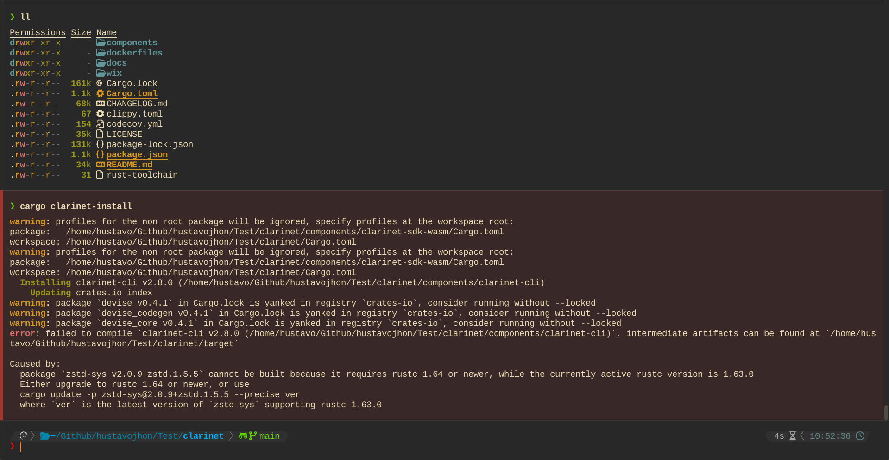

# HackingHourChallenge
The idea of hacking hour is resolving small challenges to the first experience with stacks technologies.  Basically, write your first code with Clarity to do some pieces of smart contracts and understand that Clarity is an easy and secure language to write smart contracts.

## challenges
Each tool section will have some challenges, with differences in points depend on difficulty.

### Setup your local environment: Install clarinet, add plugins to your IDE and run a demo  (1 pts)

> On Debian and Ubuntu-based distributions, please install the following packages before building Clarinet.

```bash
sudo apt install build-essential pkg-config libssl-dev

git clone https://github.com/hirosystems/clarinet.git --recursive
cd clarinet
cargo clarinet-install

git checkout main

git pull
git submodule update --recursive

% clarinet --version
clarinet-cli 1.0.2
```

<details>
    <summary>Screenshot   </summary>




</details>

```clarinet
;; An on-chain counter that stores a count for each individual

;; Define a map data structure
(define-map counters principal uint)

;; Function to retrieve the count for a given individual
(define-read-only (get-count (who principal))
  (default-to u0 (map-get? counters who))
)

;; Function to increment the count for the caller
(define-public (count-up)
  (ok (map-set counters tx-sender (+ (get-count tx-sender) u1)))
)
```